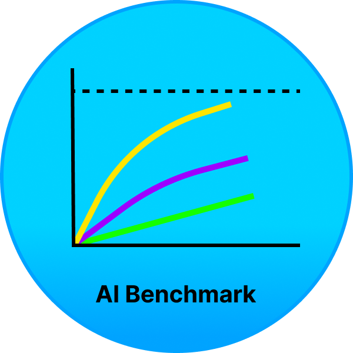

<div align="center" id="top"> 
  

  &#xa0;

  <!-- <a href="https://aibenchmark.netlify.app">Demo</a> -->
</div>

<h1 align="center">AIBenchmark</h1>
<h2 align="center">Benchmark your model against other models</h2>

<p align="center">
  

  

  

  

  <!--  -->

  <!--  -->

  <!--  -->
</p>

<!-- Status -->

<!-- <h4 align="center"> 
  🚧  NoLabs 🚀 Under construction...  🚧
</h4> 

<hr> -->

<p align="center">
  <a href="#dart-about">About</a> &#xa0; | &#xa0; 
  <a href="#sparkles-features">Features</a> &#xa0; | &#xa0;
  <a href="#Technologies">Technologies</a> &#xa0; | &#xa0;
  <a href="#checkered_flag-starting">Starting</a> &#xa0; | &#xa0;
  <a href="#memo-license">License</a> &#xa0; | &#xa0;
  <a href="https://github.com/BasedLabs" target="_blank">Author</a>
</p>

<br>

## About ##

AIBenchmark is a package which lets you quickly get the benchmark of your model based on the popular datasets and compare with existing leaderboard. It also has a nice collection of metrics which you could easily import.

We currently support 14 text-based and 2 image-based datasets for AutoBenchmarking aiming for regression/classification tasks. Available datasets could be found in aibenchmark/dataset.py file. 

Or run the following code:

```python

from aibenchmark.dataset import DatasetsList

print(list(DatasetsList.get_available_datasets()))

```

Code example for benchmarking:

```python
from aibenchmark.benchmark import Benchmark
from aibenchmark.dataset import DatasetInfo, DatasetsList


benchmark = Benchmark(DatasetsList.Texts.SST)
dataset_info: DatasetInfo = benchmark.dataset_info
print(dataset_info)

test_features = dataset_info.data['Texts']
model = torch.load(...)
# Implement your code based on the type of model you use, your pre- and post-processing etc.
outputs = model.predict(test_features)

# Results of your model based on predictions
benchmark_results = benchmark.run(predictions=outputs, metrics=['accuracy', 'precision', 'recall', 'f1_score']) 

# Metrics
print(benchmark_results)
# Existing leaderboard for this dataset
print(benchmark.get_existing_benchmarks())
```

## Features ##

1) Fast comparison of metrics of your model and other SOTA models for particular dataset
2) Supporting 16+ most populat datasets, the list is always updating. Soon we willl support more than 1000 datasets
3) All metrics in one place and we are adding new ones in a standardised way

## Starting ##

```bash
# Clone this project
$ pip install git+https://github.com/BasedLabs/aibenchmark
```

## Technologies ##

The following tools were used in this project:

- [Pytorch](https://pytorch.org/)
- [Transformers](https://huggingface.co/transformers)
- [Scikit-learn](https://scikit-learn.org/stable/)


## :memo: License ##

This project is under license from MIT. For more details, see the [LICENSE](LICENSE.md) file.


Made by <a href="https://github.com/jaktenstid" target="_blank">Igor</a> and <a href="https://github.com/timurishmuratov7" target="_blank">Tim</a>

&#xa0;

<a href="#top">Back to top</a>
